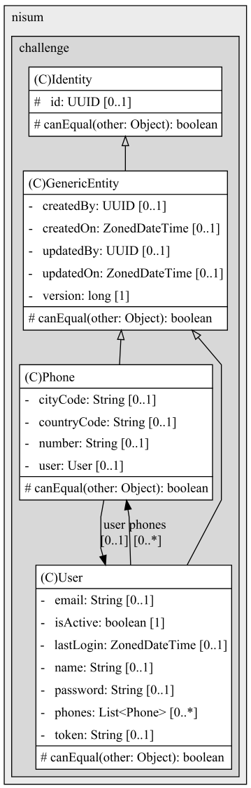

# Nisum Demo Project

This is a demo project for Spring Boot, showcasing user management functionalities.

## Prerequisites

- Java 17
- Maven 3.6+
- An IDE (e.g., IntelliJ IDEA) with Lombok and MapStruct plugins installed

## Getting Started

### Clone the Repository

```sh
git clone https://github.com/cquizo/nisum-demo.git
cd nisum-demo
```

### Build the Project
```sh
mvn clean install
```  

### Running Tests
```sh
mvn test
```

### Run the Application
```sh
mvn spring-boot:run
```
The application will start on http://localhost:8080

### Access the Swagger UI
Open http://localhost:8080/swagger-ui.html in your browser to access the Swagger UI.

### Access the H2 Console
Open http://localhost:8080/h2-console in your browser to access the H2 Console. Use the following settings:
- JDBC URL: jdbc:h2:mem:testdb
- User Name: sa
- Password: P4$$w0rd
- Click Connect
- Click on the table name to view the data
- Run SQL queries
- Click on the Execute button

## Lombok Configuration
Lombok is used to reduce boilerplate code. Ensure you have the Lombok plugin installed and enabled in your IDE.

### IntelliJ IDEA
1. Install the Lombok plugin from the IntelliJ IDEA marketplace.
2. Enable annotation processing in IntelliJ IDEA:
    - Go to `File` > `Settings` > `Build, Execution, Deployment` > `Compiler` > `Annotation Processors`.
    - Check the box next to `Enable annotation processing`.
    - Click `OK`.

### Eclipse
1. Go to Help > Eclipse Marketplace.
2. Search for Lombok and install it.
3. Enable annotation processing in Eclipse:
    - Go to `Window` > `Preferences` > `Java` > `Compiler` > `Annotation Processing`.
    - Check the box next to `Enable annotation processing`.
    - Click `OK`.

## MapStruct Configuration
MapStruct is used for mapping between objects. Ensure you have the MapStruct plugin installed and enabled in your IDE.

### IntelliJ IDEA
1. Install the MapStruct plugin from the IntelliJ IDEA marketplace.
2. Enable annotation processing in IntelliJ IDEA:
    - Go to `File` > `Settings` > `Build, Execution, Deployment` > `Compiler` > `Annotation Processors`.
    - Check the box next to `Enable annotation processing`.
    - Click `OK`.

### Eclipse
1. Go to Help > Eclipse Marketplace.
2. Search for MapStruct and install it.
3. Enable annotation processing in Eclipse:
    - Go to `Window` > `Preferences` > `Java` > `Compiler` > `Annotation Processing`.
    - Check the box next to `Enable annotation processing`.
    - Click `OK`.

## Model Structure
